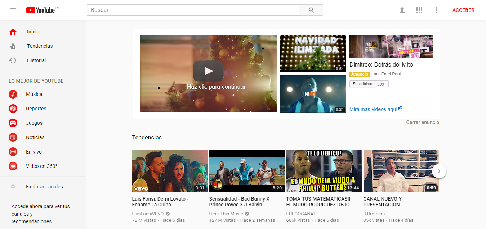

# **YOUTUBE **
En el siguiente trabajo se muestra la información detallada de las partes que conforman el UX(experiencia de el usuario) y UI (diseño) de el sitio web youtube.  

  

| UX            | UI            |
|:-------------:|:-------------:|
| Que pueda explorar los canales.   | El color de los iconos de las diferentes opciones de seleccion.|
| Que me sugiera ver lo mas visitado(las tendencias).      | El pocisionamiento de los videos.     |
| Que me de mas opciones para explorar, como la sección "Lo mejor de youtube". | El color de el Logo de la pagina .      |
| Que pueda tener un historial de los videos visitados y asi volver a verlos cuando desee. | La opcion que permite elegir el tema o color de la pantalla de mi vista.     |
| Que me permita subir de manera sencilla mis videos a la pagina. | Las opciones al reproducir un video,subtitulos,modo teatro,pantalla completa,siguiente.     |
| Que me permita ver diferentes categorias de manera aleatoria. | El cuadro de busqueda visible y siempre estatico.     |
